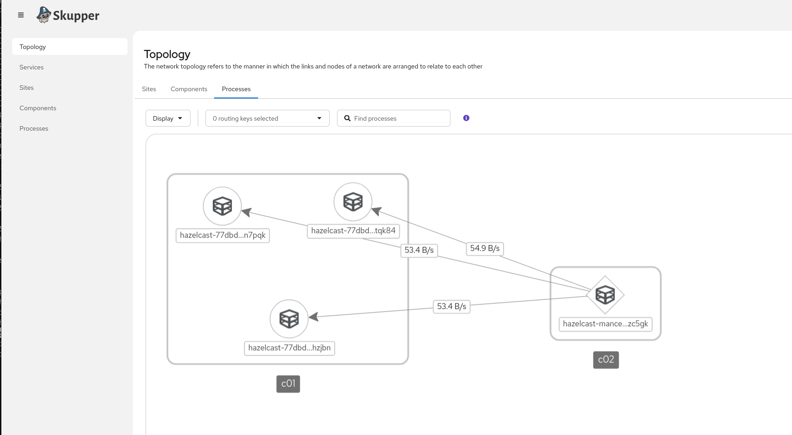

# skupper hazelcast demo

Simple example using Skupper v2 to connect a hazelcast client running on one
site to a hazelcast cluster running in a remote site.

# Setup

**Using the Client Kubernetes Cluster**
```
kubectl apply -f client.yaml
```

Adds the following resources to the namespace:
* Skupper Site
* Skupper Listener for the hazelcast service with **exposePodsByName** enabled.
* Hazelcast management center deployment with with a client configuration using
  standard kubernetes dns-based service discovery
* A LoadBalancer service to expose it outside of the cluster (optional)

**Using the Hazelcast Cluster Kubernetes Cluster**
```
kubectl apply -f cluster.yaml
```

Adds the following resources to the namespace:
* Skupper Site
* Skupper Connector for the hazelcast statefulset with **exposePodsByName** enabled.
* Hazelcast cluster Deployment with a special configuration to enable
  discovery and addressing that works across networks.
  * Sets `hazelcast.network.public-address` explicitly to the name of the pod/hostname.
  * Uses standard kuberentes service based DNS discovery.
* Headless service for cluster discovery through kubernetes pod network

# Linking the sites

Using the skupper 2.0 CLI,

In one of the sites that is accessible externally via LB or route.
```
skupper token issue accesstoken.yaml
```

In the other site
```
skupper token redeem accesstoken.yaml
```

# See Working Cluster

Once everything stabilizes you can open the management center  from the client site to see everything working.
```
kubectl describe service hazelcast-mancenter
```

*note it seems like management center has difficulty recovering after discovery
initially fails before the sites are linked. It may need restarted (kubectl
rollout restart deployment/hazelcast-mancenter).

## View from hazelcast management center

## View from the skupper network console


# Limitations

* Hazelcast cluster Members are limited to a single namespace.

Does not work for extending a hazelcast cluster across sites. It is unclear if
this is desirable, hazelcast documentation seems to suggest it may not be
ideal.

The limitation here is on the discovery side, where hazelcast expects to be
able to discover the addresses of all cluster members through a DNS query to a
headless service when establishing the cluster. From the client side, it is
enough to be load balanced to one member of an established cluster to discover
the addresses of the other members. Skupper 2.0 does not support the management
of such headless services, and it is unclear how a skupper 1.x version that
does support headless services could have been used to make this work.
